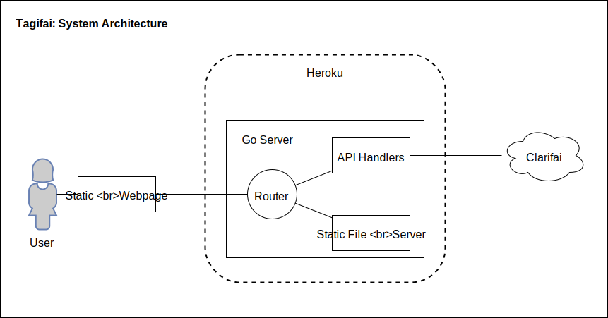

# Tagifai

Automatically generates tags by analysing your uploaded photo using the [Clarifia](https://clarifai.com/) image classification models. Just a simple experiment on working with 3rd-party REST APIs in Go.

## Requirements

* go1.10.3
* dep v0.5.0
* A free Clarifai account with an API_KEY

## Local Setup

	cd $GOPATH/src
	git clone <repo>
	cd <project>
	dep ensure
	go run main.go

## Production Deployment

This app is configured to run on Heroku.

* You need the Heroku CLI to interact with the service. `$ brew install heroku/brew/heroku`
* Login with your credentials: `$ heroku login`
* Navigate to your Go project repo
	* `heroku create <app-name>`: creates a remote repo in Heroku and generates a domain name pointing to the `master` branch.
	* Write your Go code as usual.
	* When ready, commit your changes and push to Heroku: `$ git push heroku <localbranch>:master`

> For local testing, rename *example.env* -> *.env* and supply the required environment variables. In Heroku, you'll need to set these key-value pairs in the *Config Vars* section of the app's dashboard. **These variables should be treated as secrets hence why I have not commited them to source control.**

## Developer Notes

### Tools Used

* `dep`: _Go_ dependency managment tool. Just like _npm_ for Node.js, dependencies are specified in a `Gopkg.toml`, a versioned snapshot is saved in `Gopkg.lock`, and a `/vendor` directory holds the actual source code.

#### Go on Heroku

* Static Assets & Files included in your git repository are available at runtime and can be served from the local filesystem using Go’s http.FileServer or framework equivalent. 

* In Heroku, builds use the contents of the vendor/ directory when compiling as if they are in your $GOPATH

#### Using `dep`

	brew install dep 

	dep init

	dep ensure -add <dep>
	dep ensure -add <dep1> <depN>

	dep status
	dep check

	dep ensure -update
	dep ensure -update <dep>

## Project Documentation

### Architecture

